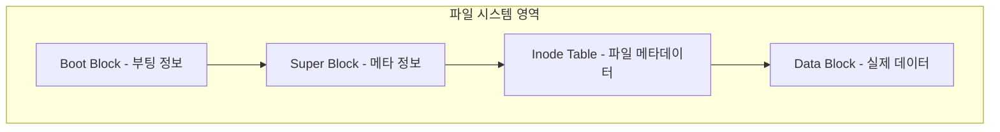
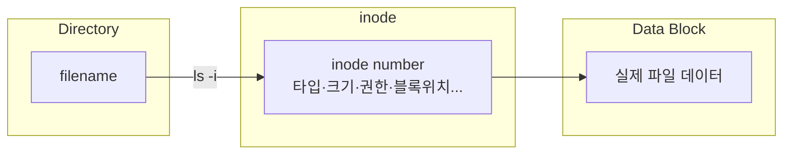
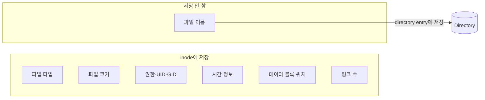
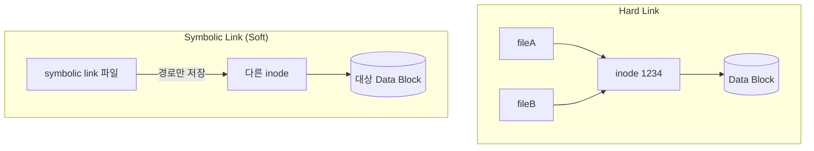
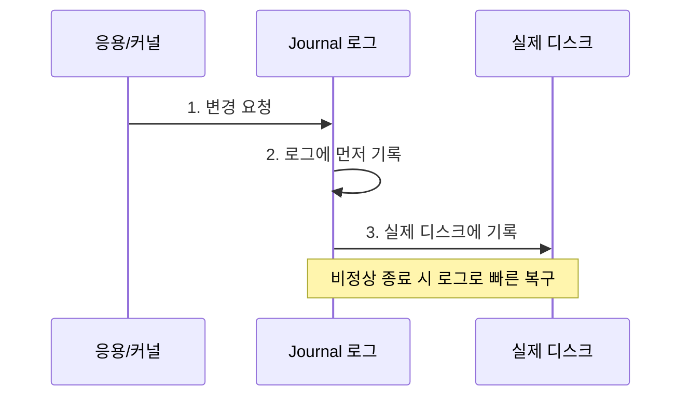
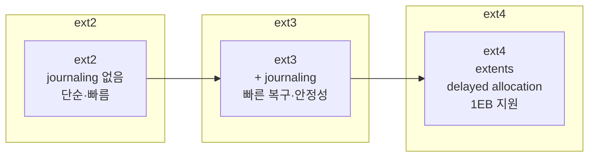
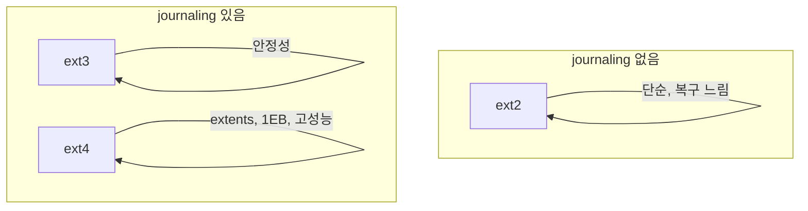
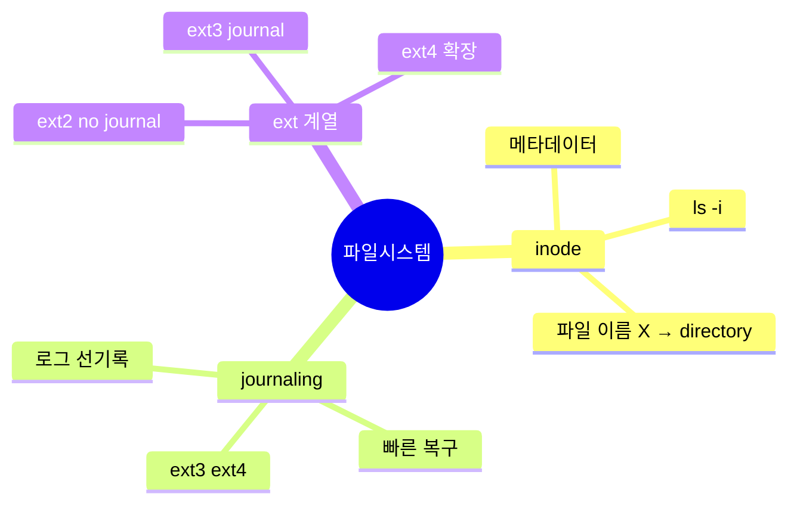

리눅스마스터 1급에서 **파일 시스템(inode / journaling / ext4)** 문제는
대부분 **개념 + 구조 + 특징 비교** 형태로 출제됩니다.

특히 다음 세 가지는 거의 반드시 등장합니다.

* **inode 구조**
* **저널링 파일 시스템**
* **ext2 / ext3 / ext4 차이**

**파일 시스템 구조 → inode → journaling → ext 계열 비교 → 시험 문제 패턴** 순서로 정리해보겠습니다.

---

# 1. 리눅스 파일 시스템 구조

리눅스 파일 시스템은 기본적으로 다음 구조로 이루어집니다.

```text
Boot Block
Super Block
Inode Table
Data Block
```

각 영역 역할

| 영역          | 역할           |
| ----------- | ------------ |
| Boot block  | 부팅 정보        |
| Super block | 파일 시스템 메타 정보 |
| Inode table | 파일 메타 데이터    |
| Data block  | 실제 데이터       |

---

# 2. inode

## inode 정의

inode는 **파일의 메타데이터를 저장하는 자료구조**입니다.

즉, 파일 이름을 제외한 모든 정보를 저장합니다.

---

## inode에 저장되는 정보

대표적으로 다음 정보가 저장됩니다.

```text
파일 타입
파일 크기
권한
UID
GID
시간 정보
데이터 블록 위치
링크 수
```

---

## inode에 저장되지 않는 것

시험에서 가장 많이 나오는 문제로 파일 이름은 **directory entry**에 저장됩니다.

정답

```text
파일 이름
```


---

## 구조

```text
Directory
   │
   ├── filename
   │
   └── inode number
           │
           └── data block pointer
```

---

# 3. inode 번호

파일에는 **inode 번호**가 있습니다.

확인 명령

```bash
ls -i
```

출력

```text
123456 file.txt
```

---

# 4. 링크와 inode 관계

## Hard Link

같은 inode 공유

```text
fileA
fileB
```

```
inode 1234
```

---

특징

* inode 동일
* 같은 데이터

---

## Soft Link

다른 inode

```text
symbolic link
```

단순 경로 참조

---

# 5. Journaling 파일 시스템

## journaling 정의

파일 시스템 변경 내용을 **로그에 먼저 기록하는 기술**

목적

```text
파일 시스템 복구 속도 향상
```

---

## 작동 방식

```text
1 데이터 변경 요청
2 journal 기록
3 실제 디스크 기록
```

---

## 장점

```text
빠른 복구
데이터 안정성
fsck 시간 감소
```

---

## 저널링 파일 시스템

대표

```text
ext3
ext4
xfs
jfs
reiserfs
```

---

# 6. ext 파일 시스템 계열

리눅스 시험에서는 **ext2 / ext3 / ext4 차이**가 중요합니다.

---

# ext2

초기 리눅스 파일 시스템

특징

```text
journaling 없음
```

장점

```text
구조 단순
빠름
```

단점

```text
복구 오래 걸림
```

---

# ext3

ext2 + journaling

특징

```text
journaling 지원
```

장점

```text
빠른 복구
안정성 향상
```

---

# ext4

현재 가장 많이 사용

특징

```text
ext3 확장
대용량 지원
성능 향상
```

---

## ext4 특징

```text
extents
delayed allocation
larger filesystem
```

---

# ext 비교

| 파일시스템 | journaling | 특징  |
| ----- | ---------- | --- |
| ext2  | 없음         | 단순  |
| ext3  | 있음         | 안정성 |
| ext4  | 있음         | 고성능 |

---

# 7. ext4 특징 (시험 포인트)

## Extents

기존

```text
block mapping
```

ext4

```text
extent mapping
```

→ 큰 파일 처리 효율

---

## delayed allocation

쓰기 성능 향상

---

## 최대 용량

ext4

```text
1EB
```

---

# 8. 시험 문제 패턴

## 문제 1

inode에 저장되지 않는 것

정답

```text
파일 이름
```

---

## 문제 2

다음 중 저널링 파일 시스템

정답

```text
ext3
ext4
```

---

## 문제 3

ext2 특징

정답

```text
journaling 없음
```

---

## 문제 4

저널링 목적

정답

```text
빠른 복구
```

---

## 문제 5

inode 확인 명령

정답

```text
ls -i
```

---

# 9. 시험 함정

## 함정 1

```text
inode는 파일 이름 저장
```

❌ 틀림

---

## 함정 2

```text
ext2는 journaling 지원
```

❌ 틀림

---

## 함정 3

```text
저널링은 데이터 백업 기술
```

❌ 틀림

---

## 함정 4

```text
inode는 실제 데이터 저장
```

❌ 틀림

데이터는

```text
data block
```

---

# 10. 시험 직전 암기

이 네 개만 기억하면 됩니다.

```text
inode = 파일 메타데이터
파일 이름 = directory entry

ext2 = no journal
ext3 = journal
ext4 = 확장
```

---

# 11. 개발자 관점 (추가 이해)

리눅스 파일 시스템 접근 구조

```text
directory
  ↓
inode
  ↓
data block
```

즉

파일 접근 과정

```text
filename
 → inode
 → data block
```

---

# 핵심 요약

시험에서는 이 세 가지가 핵심입니다.

```text
inode = 메타데이터
journal = 빠른 복구
ext4 = ext3 확장
```

---

# 다이어그램

## 1. 리눅스 파일 시스템 구조



## 2. 파일 접근 흐름 (Directory → inode → Data)



## 3. inode에 저장되는 것 vs 저장되지 않는 것



## 4. Hard Link vs Symbolic Link



## 5. 저널링(Journaling) 작동 방식



## 6. ext 계열 발전



## 7. ext2 / ext3 / ext4 비교



## 8. 시험 핵심 한눈에



---

원하시면 이어서 **리눅스마스터 1급에서 가장 자주 나오는**

* **파일 시스템 기출 문제 TOP 30**
* **권한(permission) 문제**
* **프로세스 문제**

까지 한 번에 정리해 드리겠습니다.
특히 **권한 문제는 시험에서 거의 항상 출제됩니다.**
